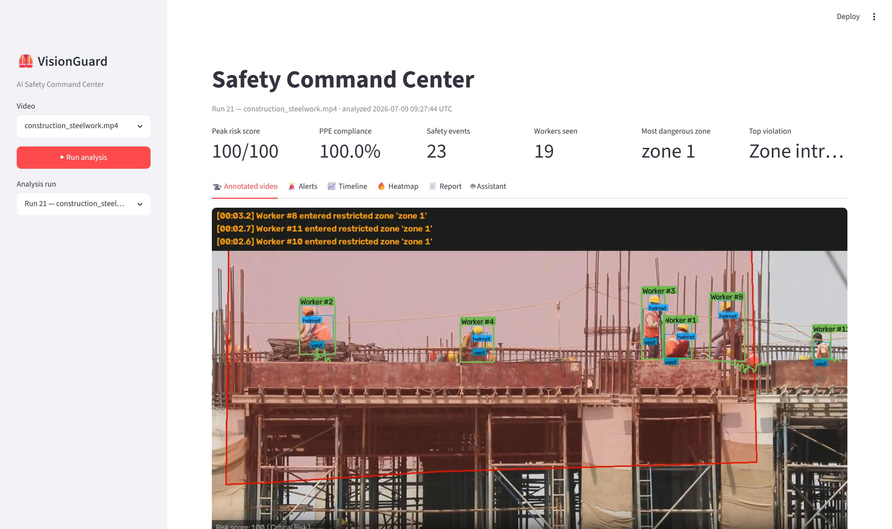
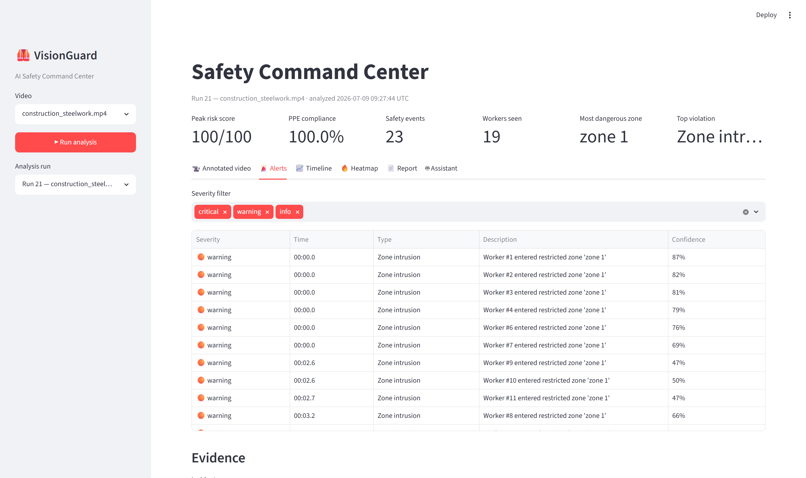
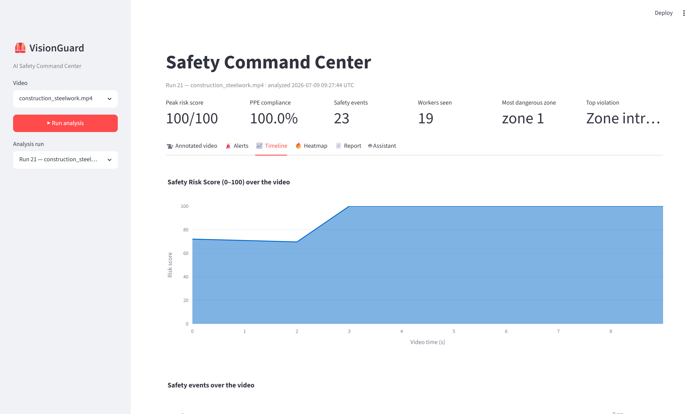
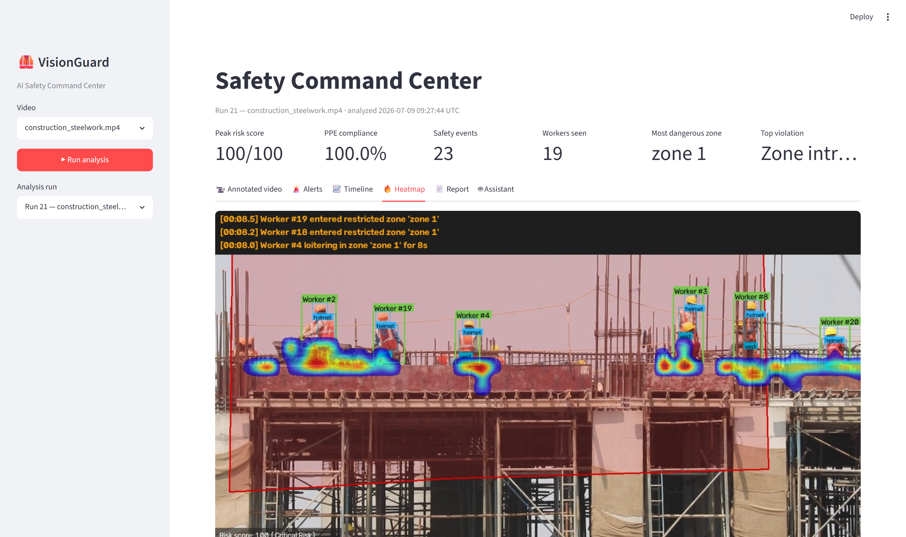
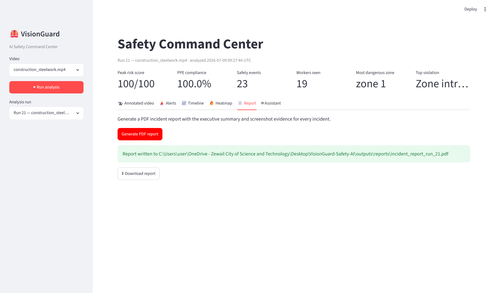
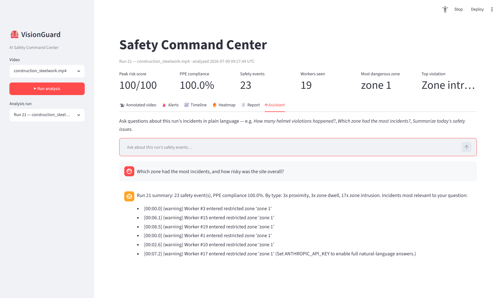

# VisionGuard Safety AI 🦺

**Real-Time Computer Vision Platform for Workplace Safety, PPE Compliance, and Hazard Intelligence**


VisionGuard turns ordinary CCTV and video streams into a **real-time safety monitoring system** for construction sites, factories, warehouses, and labs. Instead of simply detecting objects, it *reasons about the scene* — continuously answering one operational question:

> ### 💬 *"Is this workplace safe right now?"*

It detects PPE violations, restricted-zone intrusions, falls, and unsafe worker–vehicle proximity **in real-world meters**; tracks every worker with a persistent identity — even **across cameras**; condenses everything into a live **0–100 Safety Risk Score**; and produces **evidence-backed PDF incident reports**. A built-in **AI assistant** answers questions about the incident history in plain language.


---

## 📑 Table of Contents

- [Why This Project Stands Out](#-why-this-project-stands-out)
- [Feature Overview](#-feature-overview-13-features-3-phases)
- [Dashboard Tour](#-dashboard-tour)
- [Results & Evidence](#-results--evidence)
- [Edge Deployment Benchmarks](#-edge-deployment-benchmarks)
- [System Architecture](#-system-architecture)
- [Project Structure](#-project-structure)
- [Models Used](#-models-used)
- [Installation](#-installation)
- [Usage](#-usage)
- [Configuration](#-configuration)
- [Testing & Verification](#-testing--verification)
- [Engineering Field Notes](#-engineering-field-notes)
- [Tech Stack](#-tech-stack)
- [Attribution](#-attribution)

---

## 🌟 Why This Project Stands Out

Most portfolio CV projects stop at "YOLO draws boxes." VisionGuard is built as a **production-shaped safety analytics system**:

| Capability | The common shortcut | What VisionGuard does instead |
|---|---|---|
| 📏 Distance | Pixel distance (meaningless with perspective) | **Camera calibration + ground-plane homography** → distances in actual meters |
| 🔁 Identity | Per-frame detections with no memory | ByteTrack IDs **plus cross-camera Re-ID** via appearance embeddings |
| 🚨 Alerts | One alert per frame (alarm spam) | Temporal smoothing, debouncing, hysteresis, and cooldowns on **every** rule engine |
| 🧠 Behavior | Single-frame if-statements | A **GRU sequence model** over 30-frame pose windows + stay-down confirmation logic |
| ⚡ Deployment | "It runs on my GPU" | **Measured benchmark table**: PyTorch/ONNX/INT8, latency, FPS, size, platform trade-offs |
| 📈 Output | A list of detections | A single interpretable **0–100 risk score**, evidence screenshots, PDF reports, and a **RAG assistant** |
| ✅ Quality | No tests | **76 unit tests** (GPU-free, ~12 s) + a **live-footage verification suite** that caught real bugs |

---

## 🧩 Feature Overview (13 features, 3 phases)

### Phase 1 — Core MVP 🏗️

| # | Feature | How it works |
|---|---------|--------------|
| 1 | 🔍 **Multi-class detection** | YOLO11s fine-tuned on construction data detects workers, helmets, vests, their *absence* (`NO-Hardhat`, `NO-Safety Vest`), machinery, and vehicles. Detecting absence directly beats inferring it from missing overlaps |
| 2 | 🎯 **Multi-object tracking** | ByteTrack assigns persistent IDs (`Worker #12`) with trajectory trails; a Kalman motion model carries tracks through short occlusions |
| 3 | 🦺 **PPE compliance engine** | PPE evidence is associated to workers *anatomically* (helmets at head height, vests on the torso), smoothed over a rolling 2 s window to kill detector flicker, debounced with hysteresis + cooldown. Outputs per-video compliance % |
| 4 | ⛔ **Restricted zones** | Draw polygon zones on the camera view with an interactive editor; entry and loitering alerts use each worker's **ground point** (feet), with re-entry cooldown against boundary flicker |
| 5 | 🚑 **Fall detection** | YOLO11-pose keypoints → torso-angle state machine; a fall is confirmed only when a person goes horizontal **and stays down** N seconds (bending ≠ fall), with box-shape fallback when keypoints fail |
| 6 | 🖥️ **Safety Command Center** | Streamlit dashboard: KPI row, annotated playback, filterable alert table with evidence photos, incident timeline, danger heatmap, one-click report export |
| 7 | 📄 **PDF incident reports** | Executive summary + one evidence page per incident: screenshot, timestamps, involved IDs, confidence, and a recommended action |

### Phase 2 — Depth 🔬

| # | Feature | How it works |
|---|---------|--------------|
| 8 | 📏 **Calibrated proximity** | A ground-plane homography (calibrated once per camera by clicking 4+ known points) converts pixels → meters. Worker–vehicle distances are measured for real: *"Machinery #16 within 0.2 m of Worker #3"*. Two debounced tiers (warning ≤ 5 m, critical ≤ 2 m) + near-miss counting |
| 9 | 🌡️ **Safety Risk Score (0–100)** | Every event adds a configured weight that decays linearly over a rolling 60 s window — the score spikes on incidents and cools as the site behaves. Bands: 0–30 Safe · 31–60 Moderate · 61–80 High · 81–100 Critical. Live on the video HUD, charted in the dashboard, summarized in the PDF |
| 10 | 🤖 **AI Safety Assistant (RAG)** | Ask in plain language: *"How many helmet violations today?"* Exact numbers come from **SQL aggregates** (never LLM guesses), relevant incidents from **semantic search** (sentence-transformers + FAISS), and **Claude** synthesizes the grounded answer — with a deterministic fallback mode that works without any API key |

### Phase 3 — Standout Engineering 🚀

| # | Feature | How it works |
|---|---------|--------------|
| 11 | 👤 **Cross-camera Re-ID** | Each worker's appearance is embedded (CLIP image encoder); an identity gallery matches tracks against running-mean centroids by cosine similarity, so one worker keeps one **global ID** across cameras and occlusions. Demo script produces visual proof montages |
| 12 | ⚡ **Edge optimization + benchmarks** | ONNX export + INT8 dynamic quantization, with measured latency/FPS/size across five configurations on real frames ([table below](#-edge-deployment-benchmarks)) |
| 13 | 🧠 **Temporal behavior model** | A ~50K-parameter GRU classifies 30-frame pose sequences (walk / bend / **fall**) using translation- and scale-invariant body-centric features. Trained on procedurally generated skeleton sequences in ~30 s — a transparent stand-in whose featurization and training loop transfer unchanged to real labeled clips |

---

## 🖥️ Dashboard Tour

A walkthrough of the Safety Command Center analyzing `construction_steelwork.mp4` with a user-drawn restricted zone (all screenshots captured live from the running app).

**📹 Annotated video** — live playback with worker IDs, PPE evidence, the restricted zone, an alert banner, and the risk-score HUD. The KPI row on top condenses the whole run: peak risk, compliance, event count, workers seen, most dangerous zone, top violation:



**🚨 Alerts** — every incident with severity, video timestamp, type, description, and detector confidence; filterable by severity, with click-through evidence screenshots below:



**📈 Timeline** — the 0–100 risk score over the video (area chart) and the event histogram by type:



**🔥 Heatmap** — where workers actually spent their time, overlaid on the scene:



**📄 Report** — one click generates the PDF incident report (summary + evidence pages) with a download button:



**🤖 Assistant** — plain-language questions answered from the incident database (exact counts from SQL, incidents from semantic retrieval):



---

## 📸 Results & Evidence

**🚑 The full alarm chain on one clip** — zone intrusion → no-vest → no-helmet → confirmed fall (compliance 0%, risk score peaks 70/100):


**📏 Proximity detection** — distance lines in real meters, critical pairs in red:


**👤 Re-ID identity match** — the same worker re-identified across two cameras (one global ID):


**🔥 Worker-position danger heatmap** — accumulated over the full video:


**Headline numbers** (RTX 4050 Laptop 6 GB, 1280×720 processing):

| Metric | Value |
|--------|-------|
| 🏃 End-to-end pipeline speed | **25–29 FPS** (detection + pose + tracking + all rule engines + annotation + encode) |
| 🎯 Compliant-crew false alarms | **0** on the steelwork video (100% compliance, correctly) |
| 🧪 Test suite | **76 tests, ~12 s, no GPU required** |
| 📼 Live verification | 4 videos exercising every alarm feature ([details below](#-testing--verification)) |

---

## ⚡ Edge Deployment Benchmarks

`scripts/benchmark.py` exports the detector to ONNX, applies INT8 dynamic quantization, and measures **single-image inference at 640×640 including pre/post-processing** (80 real video frames per configuration, warmed up):

| Configuration | Size (MB) | Mean latency | p95 | Throughput |
|---|---|---|---|---|
| PyTorch FP32 (GPU) | 19.2 | 14.5 ms | 16.0 ms | **68.9 FPS** |
| PyTorch FP16 (GPU) | 19.2 | 12.4 ms | 12.8 ms | **80.8 FPS** |
| PyTorch FP32 (CPU) | 19.2 | 63.8 ms | 69.0 ms | **15.7 FPS** |
| ONNX Runtime FP32 (CPU) | 37.9 | 67.5 ms | 71.1 ms | **14.8 FPS** |
| ONNX Runtime INT8 (CPU) | **9.9** | 115.4 ms | 125.2 ms | **8.7 FPS** |

💡 **Notable finding:** INT8 quantization cut the model to a **quarter of the ONNX FP32 size** (small enough for microcontroller-class storage) but ran *slower* on desktop x86, where dynamically-quantized convolutions lack fast kernels — INT8's latency win materializes on ARM edge devices (Jetson, Raspberry Pi). Size-vs-speed platform dependence is exactly the trade-off an edge deployment plan must weigh.

---

## 🏛️ System Architecture

```
Video / Camera
      │  frame by frame
      ▼
┌──────────────┐   ┌──────────────┐   ┌────────────────────────────┐
│ YOLO11        │──▶│ ByteTrack    │──▶│ Safety rule engines        │
│ detection     │   │ tracking     │   │  · PPE compliance          │
│ (+ YOLO-pose) │   │ (worker IDs) │   │  · Zone entry / dwell      │
└──────────────┘   └──────┬───────┘   │  · Fall state machine      │
                          │           │  · Proximity (meters, via  │
                   ┌──────▼───────┐   │    ground-plane homography)│
                   │ Re-ID gallery │   └─────────────┬──────────────┘
                   │ (global IDs)  │                 ▼
                   └──────────────┘   ┌─────────────────────────────┐
                                      │ Risk score (0–100, decaying)│
                                      └─────────────┬───────────────┘
                                                    ▼
                              ┌─────────────────────────────────────┐
                              │ Event store (SQLite) + screenshots  │
                              └───────┬───────────┬─────────────────┘
                                      ▼           ▼            ▼
                         ┌──────────────┐  ┌───────────┐  ┌──────────────┐
                         │ Streamlit    │  │ PDF       │  │ RAG safety   │
                         │ dashboard    │  │ reports   │  │ assistant    │
                         └──────────────┘  └───────────┘  └──────────────┘
```

**Design principles:**

- 🧱 **Model-agnostic core.** The detector translates raw model labels into a canonical taxonomy (`ObjectClass.WORKER`, `ObjectClass.NO_HELMET`, …); tracking, safety rules, storage, and reporting never see YOLO internals, so models can be swapped freely.
- ⚙️ **Config-driven.** Every threshold, path, and model choice lives in [`configs/config.yaml`](configs/config.yaml), parsed into frozen typed dataclasses that fail loudly on bad config — no magic numbers in code.
- 🧪 **Testable safety logic.** All rule engines operate on plain dataclasses — the test suite runs in seconds with no GPU and no model weights.
- 📝 **Logging, not prints.** Rotating file + console logging throughout; every alert is traceable.

---

## 📁 Project Structure

```
VisionGuard-Safety-AI/
├── configs/
│   ├── config.yaml            # ⚙️ All paths, thresholds, model settings
│   ├── zones.json             # ⛔ Restricted zones (drawn with the zone editor)
│   └── calibration.json       # 📏 Camera ground-plane calibration (demo values)
├── src/visionguard/
│   ├── detection/             # 🔍 YOLO wrapper, pose estimation, core types
│   ├── tracking/              # 🎯 ByteTrack wrapper (IDs, trajectories)
│   ├── safety/                # 🚨 PPE / zones / falls / proximity / risk engines
│   ├── spatial/               # 📏 Ground-plane homography (pixels → meters)
│   ├── reid/                  # 👤 Cross-camera Re-ID (appearance gallery)
│   ├── temporal/              # 🧠 Pose-sequence behavior model (GRU)
│   ├── assistant/             # 🤖 RAG safety assistant (FAISS + Claude)
│   ├── storage/               # 💾 SQLite event store
│   ├── dashboard/             # 🖥️ Streamlit Safety Command Center
│   ├── reporting/             # 📄 PDF incident report builder
│   ├── utils/                 # 🔧 Config, logging, video I/O, drawing
│   └── pipeline.py            # 🎼 End-to-end orchestrator
├── scripts/
│   ├── download_assets.py     # ⬇️ Fetch model weights + all sample/test videos
│   ├── run_pipeline.py        # ▶️ CLI analysis runner
│   ├── define_zones.py        # ✏️ Interactive polygon zone editor
│   ├── calibrate_camera.py    # 📐 Ground-plane calibration tool
│   ├── reid_demo.py           # 👥 Cross-camera identity matching demo
│   ├── benchmark.py           # ⏱️ ONNX export + latency/FPS benchmark suite
│   └── train_temporal.py      # 🏋️ Train the pose-sequence behavior model
├── tests/                     # ✅ 76 pytest tests (pure-logic, GPU-free)
├── docs/images/               # 🖼️ README evidence images
├── data/                      # 📼 Videos & datasets (git-ignored)
├── models/                    # 🧠 Model weights (git-ignored)
└── outputs/                   # 📤 Annotated videos, screenshots, heatmaps,
                               #    reports, logs, events.db (git-ignored)
```

---

## 🧠 Models Used

| Model | Role | Params/Size | Source | License |
|-------|------|-------------|--------|---------|
| **YOLO11s (PPE fine-tune)** | Workers, PPE presence *and absence*, machinery, vehicles (8 mapped classes) | 19.2 MB | [yihong1120/Construction-Hazard-Detection](https://huggingface.co/yihong1120/Construction-Hazard-Detection) | AGPL-3.0 |
| **YOLO11n-pose** | 17 COCO keypoints per person (fall detection) | 6 MB | [Ultralytics](https://github.com/ultralytics/ultralytics) | AGPL-3.0 |
| **CLIP ViT-B/32** | Appearance embeddings for Re-ID | ~350 MB | [sentence-transformers](https://huggingface.co/sentence-transformers/clip-ViT-B-32) | Apache-2.0 |
| **all-MiniLM-L6-v2** | Text embeddings for RAG retrieval | ~90 MB | [sentence-transformers](https://huggingface.co/sentence-transformers/all-MiniLM-L6-v2) | Apache-2.0 |
| **PoseSequence GRU** | Temporal walk/bend/fall classifier | ~50K params | Trained in-repo (`scripts/train_temporal.py`) | — |
| **Claude (`claude-opus-4-8`)** | RAG answer synthesis (optional — graceful fallback without a key) | API | [Anthropic](https://www.anthropic.com) | — |

---

## 📦 Installation

Requires **Python 3.11+**. A CUDA GPU is strongly recommended (CPU works, slower).

```bash
git clone https://github.com/mohamed1232005/VisionGuard-Safety-AI.git
cd VisionGuard-Safety-AI

python -m venv .venv
.venv\Scripts\activate            # Windows   (Linux/macOS: source .venv/bin/activate)

pip install -r requirements.txt --extra-index-url https://download.pytorch.org/whl/cu121
pip install -e .

python scripts/download_assets.py # ⬇️ model weights + sample & test videos
pytest                            # ✅ all 76 tests should pass
```

> **🎮 GPU note:** `requirements.txt` pins the CUDA 12.1 PyTorch build (needs the extra index URL above; NVIDIA driver 531+). On this project's dev machine — RTX 4050, driver 537.70 — the newer cu126 wheels failed with `CUDA error: device busy or unavailable`; cu121 resolved it. CPU-only installs can drop the extra index URL and install plain `torch`.

---

## 🚀 Usage

### 🖥️ Safety Command Center (the main experience)

```bash
streamlit run src/visionguard/dashboard/app.py
```

Pick a video in the sidebar → **▶ Run analysis** → explore KPIs, annotated playback, alerts with evidence photos, the risk-score timeline, the danger heatmap, one-click PDF export, and the 🤖 Assistant chat tab.

### ▶️ Analyze a video from the CLI

```bash
python scripts/run_pipeline.py                          # config default video
python scripts/run_pipeline.py --source my_site.mp4    # any video file
python scripts/run_pipeline.py --source 0              # live webcam
```

Produces: annotated video + danger heatmap in `outputs/`, events + evidence screenshots in the SQLite store, and a console summary (FPS, compliance, event counts).

### ✏️ Draw restricted zones (once per camera)

```bash
python scripts/define_zones.py --video data/videos/construction_steelwork.mp4
```

Left-click polygon corners → **N** to name the zone → **S** to save. Zones live in `configs/zones.json` (normalized coordinates — resolution-independent).

### 📐 Calibrate real-world distances (once per camera)

```bash
python scripts/calibrate_camera.py
```

Click 4+ ground points whose real-world positions you know (e.g. corners of a slab you measured); enter each position in meters. Enables metric proximity detection.

### 👤 Cross-camera Re-ID demo

```bash
python scripts/reid_demo.py --videos camA.mp4 camB.mp4   # two cameras
python scripts/reid_demo.py                              # one video split in half
```

Prints the identity-matching table and saves montage proof sheets to `outputs/reid/`.

### ⏱️ Run the benchmarks on your machine

```bash
python scripts/benchmark.py
```

### 🏋️ Retrain the temporal behavior model

```bash
python scripts/train_temporal.py    # ~30 s; prints per-class held-out accuracy
```

### 🤖 Enable full AI assistant answers (optional)

```bash
set ANTHROPIC_API_KEY=sk-ant-...    # Windows (setx to persist)
```

Without a key, the assistant answers in a deterministic retrieval-only mode — the feature never breaks.

---

## ⚙️ Configuration

Everything tunable lives in [`configs/config.yaml`](configs/config.yaml) — no magic numbers in code. Highlights:

| Section | What you control |
|---|---|
| `video` | Source, frame skip, processing resolution |
| `detection` | Model path, confidence/IoU thresholds, device (auto/cpu/cuda) |
| `tracking` | Track activation, occlusion buffer, matching strictness |
| `ppe` | Required equipment, smoothing window, violation ratio, cooldowns |
| `zones` | Zone file, dwell threshold, re-entry cooldown |
| `fall` | Torso-angle threshold, stay-down confirmation time, cooldowns |
| `proximity` | Calibration file, warning/critical distances (meters), cooldowns |
| `risk_score` | Rolling window, per-event-type weights |
| `reid` | Embedding model, similarity threshold (site-dependent — see field notes) |
| `assistant` | Claude model, embedding model, retrieval top-k |

The loader parses YAML into **frozen typed dataclasses** — a typo or missing key fails loudly at startup, not silently mid-video.

---

## ✅ Testing & Verification

### Unit tests — 76, GPU-free, ~12 s

```bash
pytest -v
```

| Area | What's covered |
|---|---|
| 🧮 Geometry | IoU, ground points, containment, homography math (incl. perspective un-warping: a 280 px far edge and a 1080 px near edge both measure 10 m) |
| 🦺 PPE engine | Debounce windows, anatomical association, flicker immunity, overlapping workers, fail-fast config |
| ⛔ Zones | Entry/dwell/re-entry, boundary-flicker debouncing (regression test from real footage), per-class applicability |
| 🚑 Falls | Torso-angle math, stay-down confirmation, stumble rejection, duplicate suppression, keypoint-free fallback |
| 📏 Proximity | Risk tiers, escalation, cooldowns, retreat/re-approach, multi-worker independence |
| 🌡️ Risk score | Decay, clamping, weight escalation, peak memory, band labels |
| 👤 Re-ID gallery | Cross-camera identity sharing, sticky bindings, threshold boundaries, centroid learning |
| 🧠 Temporal model | Feature invariances (translation/scale), synthetic-data sanity, save/load, *does-it-actually-learn* check |
| 💾 Storage & reports | Round-trips, ordering, isolation, PDF generation, missing-evidence resilience |
| 🤖 Assistant | Fact extraction, no-key fallback, retrieval-failure resilience |

### Live-footage verification suite 📼

Every alarm feature is additionally verified on real videos (all auto-downloaded by `scripts/download_assets.py`):

| Test video | What it proves | Result |
|---|---|---|
| `construction_steelwork.mp4` | No false alarms on a *compliant* crew; proximity vs. crane machinery | 100% compliance, 0 false PPE alerts, 2 near-misses flagged |
| `test_person_down.mp4` | **The full alarm chain in one clip** | Zone intrusion → no-vest → no-helmet → **FALL (critical)**; compliance 0%; risk peaks 70/100 |
| `test_ppe_digging.mp4` | Zone alerts + boundary-flicker debouncing | 2 clean intrusion alerts (this video *found* the alert-spam bug) |
| `test_forklift.mp4` | Vehicle/machinery detection + proximity mechanics indoors | Forklifts detected, proximity events raised |

---

## 🔍 Engineering Field Notes

Honest findings from building and verifying on real footage — the kind of detail that separates a demo from a system:

- 🐛 **The verification suite caught a real bug.** A worker hovering at a zone boundary fired 7 intrusion alerts in 4 seconds (one per flicker re-entry). Fixed with a config-driven re-entry cooldown + a regression test. Alarm fatigue is the #1 killer of real safety systems.
- 🏷️ **Model docs lied about label spelling.** The PPE model's documentation lists `Machinery`/`Vehicle`; the shipped weights embed `machinery`/`vehicle`. Vehicle detection was silently dead until a log line (`ignored: [...]`) exposed it — the class map now covers both spellings, verified against the loaded model.
- 👕 **Uniformed crews are the canonical Re-ID hard case.** Identical vests + helmets compress everyone into a tight embedding cluster (measured: different-person similarity reaches 0.93). The matching threshold is site-dependent config, tuned here from a measured similarity distribution.
- 🐢 **INT8 isn't automatically faster.** 4× smaller, yes — but slower on desktop x86 (no fast kernels for dynamically-quantized convs). The win is on ARM edge hardware.
- 📷 **Zones and calibration are per-camera config.** A zone or homography drawn on one camera view is meaningless on another — which is exactly why the interactive `define_zones.py` / `calibrate_camera.py` tools exist.
- 🚗 **cu126 PyTorch + a 537-series NVIDIA driver = `CUDA error: device busy`.** Enumeration succeeds, allocation fails. The cu121 build matches the driver natively; pinned + documented in `requirements.txt`.

---

## 🛠️ Tech Stack

| Layer | Technology |
|---|---|
| Detection & pose | Ultralytics YOLO11 (PyTorch, CUDA) |
| Tracking | ByteTrack (supervision) |
| Spatial reasoning | OpenCV homography (`findHomography`, `perspectiveTransform`) |
| Re-ID | CLIP ViT-B/32 (sentence-transformers) |
| Temporal model | PyTorch GRU |
| RAG assistant | FAISS + sentence-transformers + Anthropic Claude |
| Storage | SQLite (stdlib, zero-config; schema designed for a later Postgres swap) |
| Dashboard | Streamlit + Plotly |
| Reports | ReportLab |
| Edge | ONNX / ONNX Runtime + INT8 dynamic quantization |
| Quality | pytest (76 tests), typed frozen-dataclass config, rotating-file logging, pinned requirements |

---

## 🙏 Attribution

| Asset | Source | License |
|-------|--------|---------|
| PPE detection model | [yihong1120/Construction-Hazard-Detection](https://huggingface.co/yihong1120/Construction-Hazard-Detection) | AGPL-3.0 |
| YOLO11 / YOLO11-pose | [Ultralytics](https://github.com/ultralytics/ultralytics) | AGPL-3.0 |
| Steelwork video | [Pexels — manas patra](https://www.pexels.com/video/workers-on-construction-11798561/) | Pexels License |
| Test videos (person down / digging / forklift) | Pexels — Ron Lach, K., kelly | Pexels License |

Built as a portfolio project demonstrating end-to-end computer-vision engineering: perception → tracking → spatial & temporal reasoning → risk analytics → product surfaces (dashboard, reports, assistant) → edge deployment, with tests and measured results at every layer. 🦺
