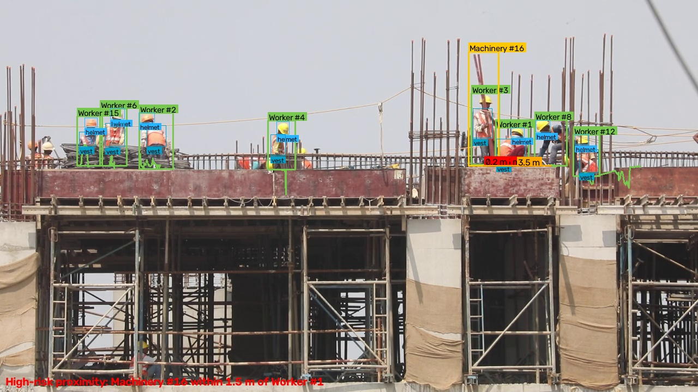
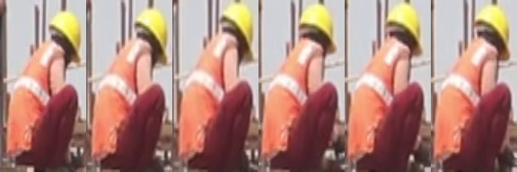
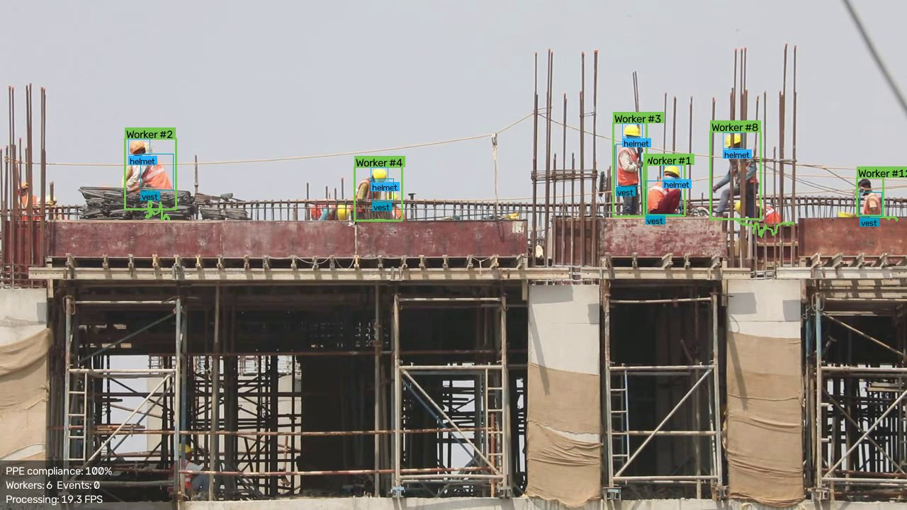
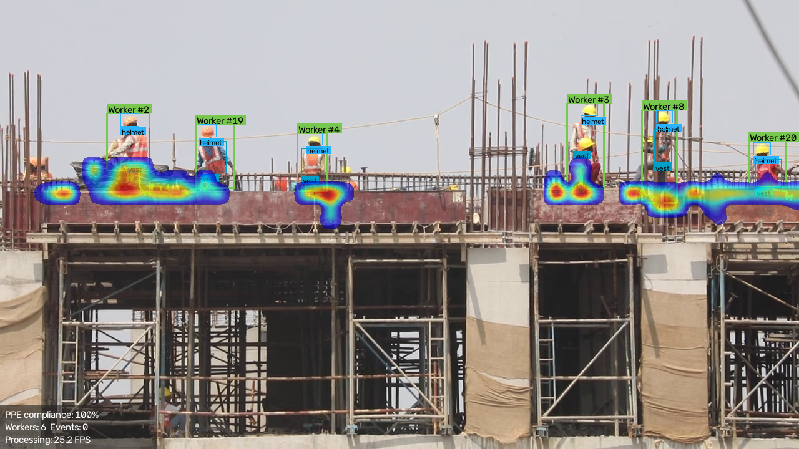
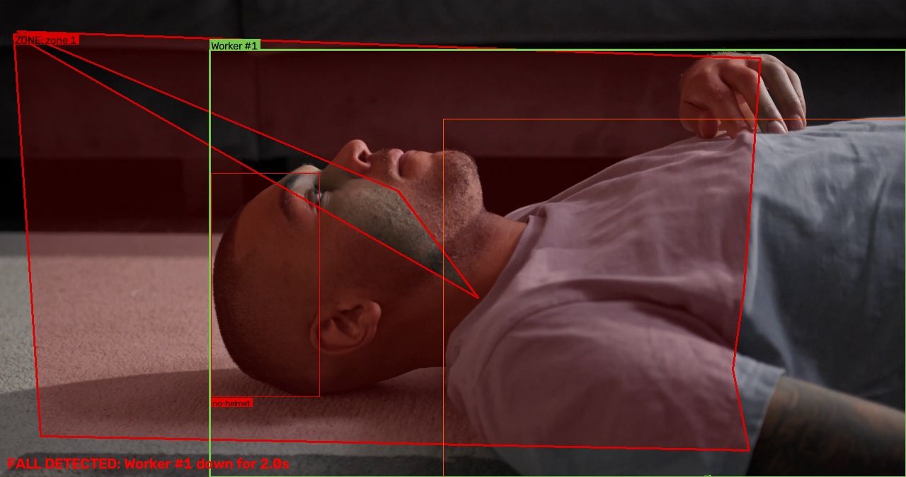

# VisionGuard Safety AI 🦺

**Real-Time Computer Vision Platform for Workplace Safety, PPE Compliance, and Hazard Intelligence**

VisionGuard turns ordinary CCTV and video streams into a real-time safety monitoring system for construction sites, factories, warehouses, and labs. Instead of simply detecting objects, it reasons about the scene — continuously answering one operational question: **"Is this workplace safe right now?"**

> **Status: Phase 1 (Core MVP) complete** — detection, tracking, PPE compliance, restricted zones, fall detection, command-center dashboard, and PDF incident reports, end to end.

---

## What it does (Phase 1)

| Feature | How it works |
|---------|--------------|
| **Multi-class detection** | YOLO11 fine-tuned on construction safety data detects workers, helmets, safety vests, their *absence* (`NO-Hardhat`, `NO-Safety Vest`), machinery, and vehicles |
| **Multi-object tracking** | ByteTrack assigns persistent IDs (`Worker #12`) and trajectories, surviving short occlusions via Kalman-filter motion prediction |
| **PPE compliance engine** | PPE evidence is associated to workers anatomically (helmets at head level, vests on the torso), smoothed over a rolling time window to kill detector flicker, and debounced with hysteresis + cooldown so one worker can't spam alerts |
| **Restricted zones** | Draw polygon zones on the camera view with an interactive editor; entry and dwell-time violations are detected using each worker's *ground point* (feet, not box overlap) |
| **Fall detection** | YOLO11-pose keypoints → torso-angle state machine; a fall is confirmed only when a person goes from upright to horizontal **and stays down** for N seconds |
| **Command center dashboard** | Streamlit app: KPI row, annotated video playback, filterable alert table with screenshot evidence, incident timeline, danger heatmap |
| **PDF incident reports** | One click generates an executive summary + per-incident evidence pages with screenshots and recommended actions |

Every safety event is persisted to a SQLite event store with screenshot evidence — the foundation for the Phase 2 RAG assistant.

## Roadmap

- [x] **Phase 1 — Core MVP**
- [x] **Phase 2 — Depth**: worker–vehicle proximity in real-world meters (camera calibration + ground-plane homography), 0–100 Safety Risk Score, RAG-based AI safety assistant over the event history
- [x] **Phase 3 — Standout engineering**: cross-camera Re-Identification, ONNX edge optimization with measured benchmarks, temporal pose-sequence behavior model

### Phase 2 highlights

| Feature | How it works |
|---------|--------------|
| **Calibrated proximity** | A ground-plane homography (calibrated once per camera with `scripts/calibrate_camera.py`) converts pixel positions to real-world meters — so "forklift within 1.5 m of Worker #1" means actual meters, not misleading pixel distance. Two debounced risk tiers (warning ≤5 m, critical ≤2 m) with per-pair cooldowns and near-miss counting |
| **Safety Risk Score (0–100)** | Every event adds its configured weight, decaying linearly over a rolling window — the score spikes on incidents and cools as the site behaves. Bands: 0–30 Safe · 31–60 Moderate · 61–80 High · 81–100 Critical. Shown live on the video HUD, plotted in the dashboard, summarized in the PDF |
| **AI Safety Assistant (RAG)** | Ask questions in plain language ("How many helmet violations today?"). Exact numbers come from SQL aggregates; relevant incidents come from semantic search (sentence-transformers + FAISS); Claude synthesizes the grounded answer. Works in retrieval-only mode without an API key |

**Proximity detection in action** (distance lines in real meters, critical pairs in red):



### Phase 3 highlights

| Feature | How it works |
|---------|--------------|
| **Cross-camera Re-ID** | Each worker's appearance is embedded (CLIP image encoder) into a vector; an identity gallery matches new tracks against running-mean centroids by cosine similarity, so the same worker keeps one **global ID** across cameras and after occlusions. `scripts/reid_demo.py` matches identities across two videos and saves visual proof montages |
| **Edge optimization + benchmarks** | `scripts/benchmark.py` exports the detector to ONNX, applies INT8 dynamic quantization, and measures latency/FPS/size across every configuration on real frames (results below) |
| **Temporal behavior model** | A ~50K-parameter GRU classifies 30-frame pose sequences (walk / bend / **fall**) using translation- and scale-invariant body-centric features. Trained on procedurally generated skeleton sequences (`scripts/train_temporal.py`, reproducible in ~30 s) — an honest, documented stand-in for labeled clips; the featurization and training loop transfer unchanged to real footage |

**Re-ID identity match** — the same worker re-identified across two cameras (crops from both, one global ID):



*Honest engineering note:* uniformed crews are the canonical hard case for Re-ID — identical vests and helmets compress everyone into a tight embedding cluster (measured on this video: different-person similarity reaches 0.93). The matching threshold is therefore config-tuned per site, and the demo documents both the successes and the residual merges.

### Edge deployment benchmarks

Measured on this project's dev machine (RTX 4050 Laptop 6 GB / Intel CPU), single-image inference at 640×640 including pre/post-processing, 80 real video frames per configuration:

| Configuration | Size (MB) | Mean latency | p95 | Throughput |
|---|---|---|---|---|
| PyTorch FP32 (GPU) | 19.2 | 14.5 ms | 16.0 ms | **68.9 FPS** |
| PyTorch FP16 (GPU) | 19.2 | 12.4 ms | 12.8 ms | **80.8 FPS** |
| PyTorch FP32 (CPU) | 19.2 | 63.8 ms | 69.0 ms | **15.7 FPS** |
| ONNX Runtime FP32 (CPU) | 37.9 | 67.5 ms | 71.1 ms | **14.8 FPS** |
| ONNX Runtime INT8 (CPU) | 9.9 | 115.4 ms | 125.2 ms | **8.7 FPS** |

Notable finding: INT8 dynamic quantization cut the model to **a quarter of the ONNX FP32 size** (9.9 MB — small enough for microcontroller-class storage) but ran *slower* on desktop x86, where dynamically-quantized convolutions lack fast kernels. INT8's latency win materializes on ARM edge devices (Jetson, Raspberry Pi) — size reduction and platform-dependence are exactly the trade-offs an edge deployment plan must weigh.

## Architecture

```
Video / Camera
      │
      ▼
┌──────────────┐   ┌──────────────┐   ┌────────────────────────────┐
│ YOLO11        │──▶│ ByteTrack    │──▶│ Safety rule engines        │
│ detection     │   │ tracking     │   │  · PPE compliance          │
│ (+ YOLO-pose) │   │ (worker IDs) │   │  · Zone entry / dwell      │
└──────────────┘   └──────────────┘   │  · Fall state machine      │
                                      └─────────────┬──────────────┘
                                                    ▼
                              ┌─────────────────────────────────────┐
                              │ Event store (SQLite) + screenshots  │
                              └───────┬─────────────────┬───────────┘
                                      ▼                 ▼
                         ┌────────────────────┐  ┌──────────────────┐
                         │ Streamlit command  │  │ PDF incident     │
                         │ center dashboard   │  │ reports          │
                         └────────────────────┘  └──────────────────┘
```

Design principles:

- **Model-agnostic core.** The detector translates raw model labels into a canonical taxonomy (`ObjectClass.WORKER`, `ObjectClass.NO_HELMET`, …); tracking, safety rules, storage, and reporting never see YOLO internals, so models can be swapped freely.
- **Config-driven.** Every threshold, path, and model choice lives in [`configs/config.yaml`](configs/config.yaml), parsed into frozen typed dataclasses that fail loudly on bad config.
- **Testable safety logic.** All rule engines operate on plain dataclasses — the 37-test suite runs in seconds with no GPU or model weights.

## Project structure

```
VisionGuard-Safety-AI/
├── configs/
│   ├── config.yaml            # All paths, thresholds, model settings
│   └── zones.json             # Restricted zones (drawn with the zone editor)
├── src/visionguard/
│   ├── detection/             # YOLO wrapper, pose estimation, core types
│   ├── tracking/              # ByteTrack wrapper (IDs, trajectories)
│   ├── safety/                # PPE / zones / falls / proximity / risk engines
│   ├── spatial/               # Ground-plane homography (pixels -> meters)
│   ├── reid/                  # Cross-camera Re-ID (appearance gallery)
│   ├── temporal/              # Pose-sequence behavior model (GRU)
│   ├── assistant/             # RAG safety assistant (FAISS + Claude)
│   ├── storage/               # SQLite event store
│   ├── dashboard/             # Streamlit Safety Command Center
│   ├── reporting/             # PDF incident report builder
│   ├── utils/                 # Config, logging, video I/O, drawing
│   └── pipeline.py            # End-to-end orchestrator
├── scripts/
│   ├── download_assets.py     # Fetch model weights + sample video
│   ├── run_pipeline.py        # CLI analysis runner
│   ├── define_zones.py        # Interactive polygon zone editor
│   ├── calibrate_camera.py    # Ground-plane calibration (pixels -> meters)
│   ├── reid_demo.py           # Cross-camera identity matching demo
│   ├── benchmark.py           # ONNX export + latency/FPS benchmark suite
│   └── train_temporal.py      # Train the pose-sequence behavior model
├── tests/                     # pytest suite (pure-logic, GPU-free)
├── data/                      # Videos & datasets (git-ignored)
├── models/                    # Model weights (git-ignored)
└── outputs/                   # Annotated videos, screenshots, heatmaps,
                               # reports, logs, events.db (git-ignored)
```

## Setup

Requires **Python 3.11+**. A CUDA GPU is strongly recommended (CPU works, slower).

```bash
git clone <repo-url>
cd VisionGuard-Safety-AI

python -m venv .venv
.venv\Scripts\activate            # Windows   (Linux/macOS: source .venv/bin/activate)

pip install -r requirements.txt   # see GPU note below
pip install -e .

python scripts/download_assets.py # model weights + sample video
pytest                            # verify: all tests should pass
```

**GPU note:** `requirements.txt` pins the CUDA 12.1 PyTorch build, which needs the extra index URL:

```bash
pip install -r requirements.txt --extra-index-url https://download.pytorch.org/whl/cu121
```

Driver compatibility matters: NVIDIA driver 531+ supports the cu121 wheels. (On this project's dev machine — RTX 4050, driver 537.70 — the newer cu126 wheels failed with `CUDA error: device busy or unavailable`; cu121 resolved it.)

## Usage

**Analyze a video (CLI):**

```bash
python scripts/run_pipeline.py                          # config default video
python scripts/run_pipeline.py --source my_site.mp4    # specific file
python scripts/run_pipeline.py --source 0              # live webcam
```

Produces: annotated video + danger heatmap in `outputs/`, events + evidence screenshots in the event store, and a console summary.

**Draw restricted zones:**

```bash
python scripts/define_zones.py        # click vertices, N = finish zone, S = save
```

**Launch the Safety Command Center:**

```bash
streamlit run src/visionguard/dashboard/app.py
```

Run analyses from the sidebar, explore alerts/timeline/heatmap, export PDF reports.

## Results

Measured on an RTX 4050 Laptop GPU (6 GB), 1280×720 processing resolution, sample construction video (486 frames @ 50 fps source):

| Metric | Value |
|--------|-------|
| End-to-end processing speed | **25–29 FPS** (detection + pose + tracking + rules + annotation + video encode) |
| Detection / pose models | YOLO11s (PPE fine-tune) / YOLO11n-pose, both on CUDA |
| PPE compliance on sample video | 100% — correct: all workers wear helmet + vest (0 false alarms) |
| Test suite | 76 tests, ~12 s, no GPU required |

**Annotated output** — persistent worker IDs, PPE evidence, trajectory trails, live HUD:



**Worker-position danger heatmap** (accumulated over the full video):



## Feature verification suite

Beyond unit tests, every alarm-raising feature is verified on real footage (all clips fetched by `scripts/download_assets.py`; analyze any of them with `python scripts/run_pipeline.py --source data/videos/<name>.mp4`):

| Test video | What it proves | Result |
|---|---|---|
| `construction_steelwork.mp4` | Detection, tracking, PPE compliance on a *compliant* crew (no false alarms), proximity vs. crane machinery | 100% compliance, 0 false PPE alerts; 2 near-misses flagged |
| `test_person_down.mp4` | The full alarm chain on one clip | Zone intrusion → no-vest → no-helmet → **FALL (critical)**; compliance 0%; risk score peaks 70/100 |
| `test_ppe_digging.mp4` | Zone entry alerts + boundary-flicker debouncing | 2 clean intrusion alerts (regression-tested after this video exposed an alert-spam bug) |
| `test_forklift.mp4` | Vehicle/machinery detection + proximity mechanics indoors | Forklifts detected, proximity events raised |

**Fall detection firing** (zone overlay, missing-PPE evidence, and the confirmed-fall banner):



*Field notes from this suite:* it caught a real bug (zone re-entry alert spam from boundary flicker — fixed with a config-driven cooldown and a regression test), and it demonstrates that zones and camera calibration are **per-camera config**: the forklift clip reuses the steelwork camera's calibration, so its "meters" are not meaningful until that camera is calibrated — exactly why `calibrate_camera.py` exists.

## Models & attribution

| Model | Source | License |
|-------|--------|---------|
| PPE detection (YOLO11s) | [yihong1120/Construction-Hazard-Detection](https://huggingface.co/yihong1120/Construction-Hazard-Detection) | AGPL-3.0 |
| Pose (YOLO11n-pose) | [Ultralytics](https://github.com/ultralytics/ultralytics) | AGPL-3.0 |
| Sample video | [Pexels — manas patra](https://www.pexels.com/video/workers-on-construction-11798561/) | Pexels License |

## Tech stack

Python 3.11 · PyTorch (CUDA) · Ultralytics YOLO11 · supervision (ByteTrack) · OpenCV · Streamlit · Plotly · ReportLab · SQLite · pytest
